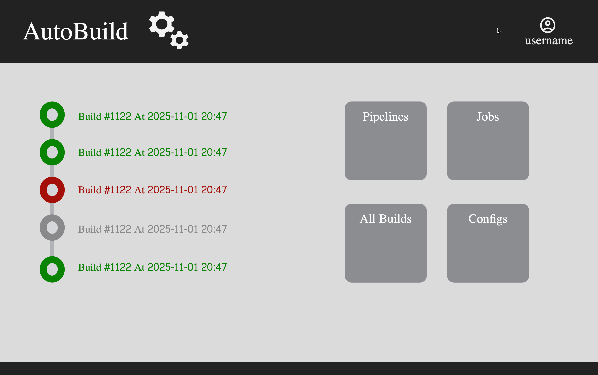

# Landing Page
This is the designed Landing Page,

## Key Points to consider:
1. The left side shows build history. It shows latest job's status. It should change automatically.
2. The right side shows collection of apps for various purpose,
   - **Pipelines** takes to pipeline list report page.
   - **Jobs** takes to all configured jobs.
   - **All Builds** takes to list report page of all builds.
   - **Configs** takes to app configuration.
  > **Note**: check if descriptions can be added in the tiles
3. The Top side is nav bar showing App Title, Logo and Username for now. Need to add some other fields in the nav bar.
4. The bottom side is a footer bar which will show some info about the organization. The exact info is to be decided.
